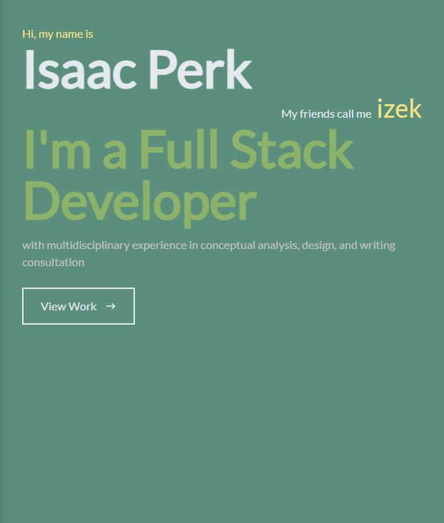

# izek Portfolio

Link to site: [Site](izek.dev)

## Description

This is my first project using REACT. It is a simple portfolio website that I will use to showcase some of the things I have been working on. It is fully functional and I will continually update it as time goes on.

## Questions

For questions/concerns you can reach me on [GitHub](https://github.com/dingbat-weasel) or by Email at perk.isaac@gmail.com.

---

## License

MIT License
